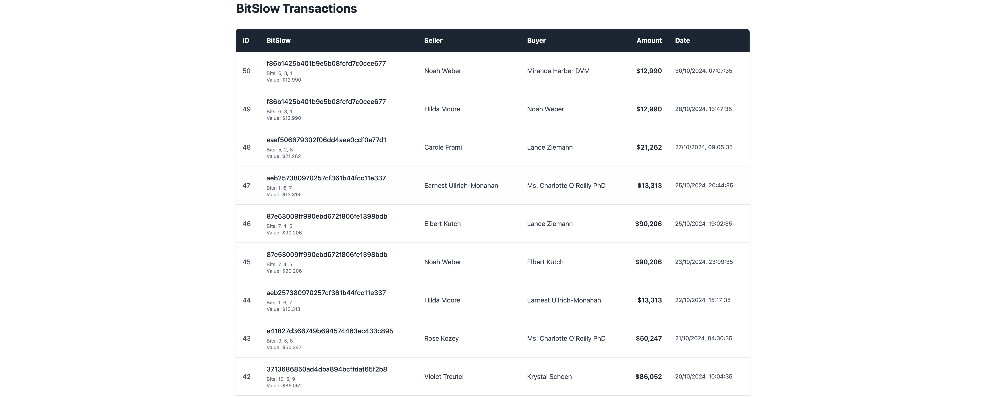

# ThemeIsle Internship Test

Welcome! This test consists of a series of practical tasks designed to evaluate your skills and familiarity with web applications.

## Evaluation Criteria

The following criteria will be assessed:

- **Code Abstraction** – The quality of function and variable names, modularity, and overall code organization.
- **Database Management** – Efficiency in handling queries, caching, and data operations.
- **User Interface (UI) & User Experience (UX)** – Ease of interaction, readability, and overall intuitiveness of the interface.
- **Performance** – Speed and efficiency in loading and processing data.

## Implementation Guidelines

- Feel free to install any libraries that you find useful to solve the tasks.
- You are encouraged to use **AI tools** to assist in solving the task. However, you should be able to justify your choices and fully understand the decisions made in the application.
- When trying to find optimizations, start with simple things like caching, proper indexing of database queries, and minimizing unnecessary API calls. For intensive compute operations leverage the asynchronous features of JavaScript - if you want something like a job queue you do not need to install a separate service for it.
- This project is built using **Bun** for ease of use and quick setup. (We recommend using the structure of the Single Page Application (SPA))
- For UI design, you are free to choose any style that best suits this type of application. Our main focus is on the solutions you implement to enhance user interaction and experience. **Animations are great, but use them in moderation**.
- The **database schema** can be modified as needed (and some task might need it). If you make any changes that is non-obvious, please attach a **comment explaining the reason** for the modification (e.g., improving ease of use, performance optimization, caching efficiency, etc.). Make sure that the function `seedDatabase` is up to date with your new schema.
- You can use other SQL databases to connect. Database creation and schema definitions must be still done by code by changing the function `seedDatabase`.
- When implementing new **API endpoints**, ensure **robust error handling** that properly communicates with the UI.
- When designing the UI, **make it responsive**. Consider the experience of users on **mobile devices and tablets**.
- Test with different scenarios using the `seedDatabase` function. Check if you can handle `1000` transactions. **By default the SQLite database is created in memory, you might need to change it if your machine can not handle it**.
- Use the analysis provided by the `bun run lint` to improve your codebase with best practices.

### Resources

You can consult those resources to help you solve the tasks:

- https://bun.sh/docs/api/http
- https://bun.sh/docs/api/sqlite
- https://react.dev/reference/react
- https://tailwindcss.com/docs/styling-with-utility-classes
- https://restfulapi.net/resource-naming/
- https://learn.microsoft.com/en-us/azure/architecture/best-practices/api-design
- https://www.restapi.guru/optimizing-rest-api-performance

## Submitting the solution

You can share your experience in the [Feedback](./FEEDBACK.md) file. Examples:

- What was the most challenging part?
- Which aspects of the application did you enjoy implementing?
- Any suggestions for improvement?

Please add screenshots of the application to the `screenshots` folder. You can also add videos.

Make sure your code is **formatted** using `bun run format` (more about it down below).

We recommend posting your solution on a Git platform (GitHub preferred) and sending us the repository link. If you want to add videos but the platform doesn't allow them due to size limits, you can use any video platform and include the links in the `FEEDBACK.md` file.

The screenshots should show the completion of all the task related to UI. Videos or GIFs should show the user experience and the performance (e.g.: page loading).

Good luck! 🚀

## Story (Introduction)

Alberto Rodrigo was a proud inventor of BitSlow, a quirky digital currency favored by an exclusive club in the vibrant heart of Barcelona. Though his app was straightforward, Alberto's users were often left frustrated by their experience.

They frequently complained about unbearably long loading times, excessive memory usage that repeatedly crashed their browsers, a glaring absence of transaction filters, and a perplexing process of adding transactions—one that involved personally emailing Alberto each time.

Despite being well aware of these shortcomings, Alberto found himself content with how things were running, especially given the remarkable profits the app generated.

One sunny afternoon, while indulging his success at the Porsche store, Alberto's phone buzzed frantically with a news alert. His heart skipped a beat as he read that BitSlow had caught the eye of international media. Almost immediately, a wave of enthusiastic emails from potential customers flooded his inbox. Filled with confidence and excitement, Alberto even considered heading straight to the Ferrari dealership.

However, his joy was abruptly shattered by another alert. His hands began to tremble, sweat streaming down his forehead as he read the alarming news: a group of talented dropouts from Harvard, Stanford, and MIT had secured a staggering $50 million from heavyweight investors like gCombinator and s9t. Their ambitious mission? Transform BitSlow into a global currency supported by the largest trading platform ever built.

Panic surged through Alberto. The sudden realization that his cherished business could become obsolete overnight struck him hard. Determined, he rushed home, feverishly attempting to upgrade his outdated app, desperately hoping his loyal users wouldn't desert him immediately.

Yet, Alberto faced a daunting obstacle—he was hopelessly out of touch with current technology. His app had run almost effortlessly for 15 long years, requiring minimal attention. Feeling overwhelmed by the latest tech jargon and trends, Alberto stumbled upon communities buzzing about "vibe coding" and powerful AI tools that made his simple methods seem prehistoric.

Brimming with hopeful enthusiasm, Alberto dove headfirst into this world of "vibe coding." But after a week of relentless trial and error, his app fell apart, suffocating under an avalanche of unfamiliar libraries and frameworks. Lost in a sea of confusing terminology—shadcn, vite, useEffect, end-to-end tests, smoke tests, web components, NoSQL databases, AI agents—Alberto felt defeated. Frustrated and bewildered, he wondered aloud, "Why all this complexity when I built everything with a humble $2 VPS and Notepad++ from a cozy coffee shop?"

In that humbling moment, Alberto understood he couldn't do it alone. He urgently needed someone well-versed in modern technology—someone who could help him reclaim the future he once saw clearly.

#### What is a BitSlow coin?

A BitSlow coin is represented by a hash generate using Alberto's secret formula. You take 3 random numbers from range 1 to 10 and combine using a special combination then feed it to `md5` hash function. With this formula, Alberto can generated up to 1000 BitSlows.

Example: the combination of `(6, 3, 2)` generate the hash `231e537a879422fa8e11ea360f6db10d`.

## Tasks



Alberto has outlined the following clear requirements to modernize and enhance the usability of the BitSlow application:

### **1. User Registration (Sign-Up Page)**

**Goal:** Create a secure and intuitive **sign-up page** for new users.

**Features to Implement:**

- A simple registration form.
- Secure password support (hashed & stored securely).
- Basic validation for input fields.

---

### **2. User Authentication (Login Page)**

**Goal:** Implement a seamless login system with a user dashboard.

**Features to Implement:**

- Secure login authentication.
- After logging in, the user should access a **profile page** displaying:
  - **Total transactions** they have made.
  - **Total BitSlow currency** they own.
  - **Total monetary value** of their holdings.

---

### **3. Transaction Dashboard Enhancements**

**Goal:** Improve the transaction dashboard for better usability and performance.

**Features to Implement:**

- **Pagination:** Allow users to view **15, 30, or 50 transactions per page**.
- **Smooth navigation:** Users should easily browse pages (**1, 2, …, 50**).
- **Filtering Options:**
  - By **Date Range** (Start & End Dates).
  - By **BitSlow Value Range**.
  - By **Buyer Name**.
  - By **Seller Name**.

Bonus Challenge: New transactions should appear without requiring a manual refresh.

---

### **4. Performance & User Experience Enhancements**

**Goal:** Optimize loading speed and improve usability.

**Features to Implement:**

- Minimize page load time.
- Provide **clear error messages** when issues occur.
- Implement **visual indicators** (e.g., loading spinners, success/error messages).

---

### **5. Buying BitSlow Coins**

**Goal:** Build a feature-rich **marketplace** for users to buy and generate BitSlows.

**Features to Implement:**

- **BitSlow Marketplace Dashboard:**
  - Displays all **available BitSlows** (paginated, 30 per page).
  - Shows each coin’s details:
    - **Hash** (Unique ID).
    - **Component Numbers** (3 numbers used in the hash).
    - **Monetary Value**.
    - **Current Owner (if any).**
  - Includes a **"Buy" button** (only for unowned BitSlows).
- **Buying Process:**
  - When a user **buys** a BitSlow, a new **transaction is recorded**, and **ownership is transferred**. (No need to check if the buyer can afford it, but change the owner with the new transaction).
- **Generating New BitSlows:**
  - Users can **generate a new BitSlow** by clicking **"Generate Coin"**.
  - They must enter an amount. (Think what component is the best for representing this: modal, new page, etc.)
  - The system should **find 3 unique numbers** that haven't been used in an existing BitSlow.
  - If no unique combinations remain, the **"Generate Coin"** button should disappear.

Bonus Challenge: For each coin, offer the possibility to display the previous owners of the coin based on the transaction history. (Tip: It can be a simple button that displays a popup with the owner list).

### Working with Bun

To install dependencies:

```bash
bun install
```

To start a development server:

```bash
bun dev
```

To run for production:

```bash
bun start
```

To run tests:

```bash
bun test
```

To run format the code:

```bash
bun run format
```

To check for possible errors:

```bash
bun run lint
```
